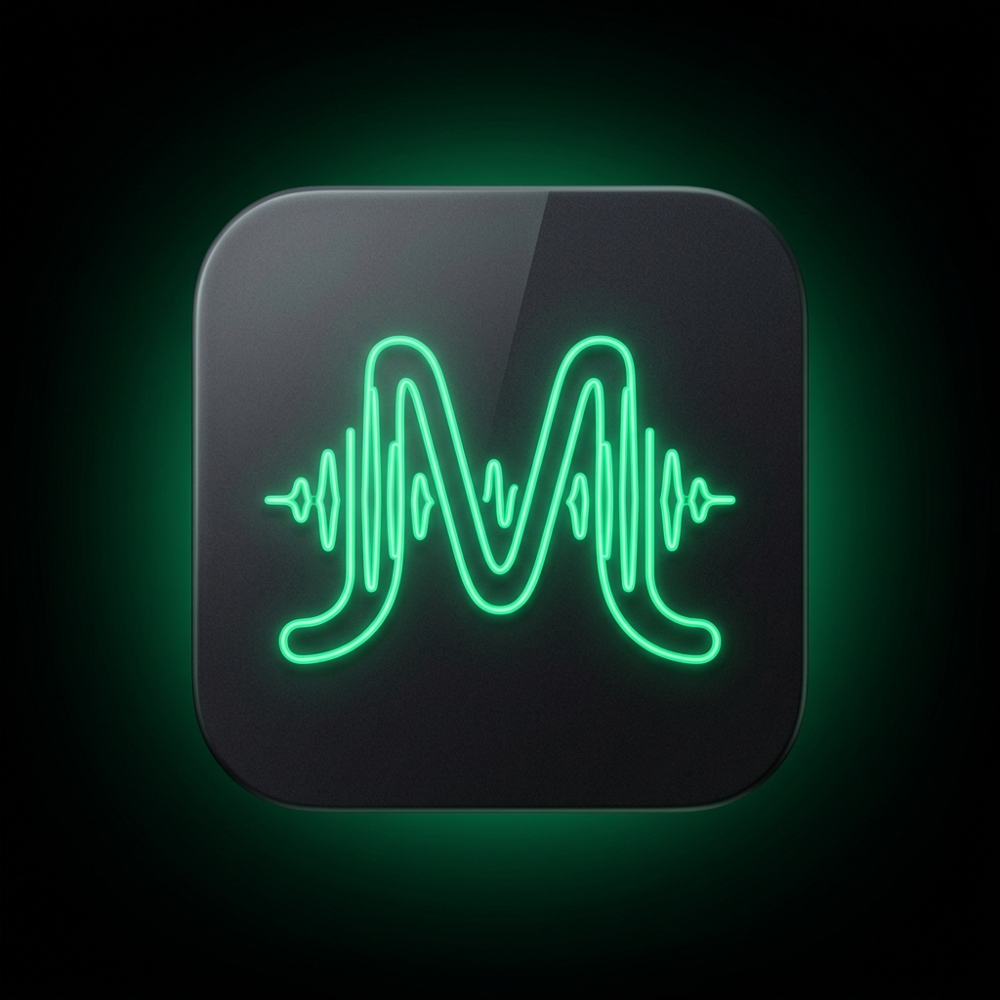
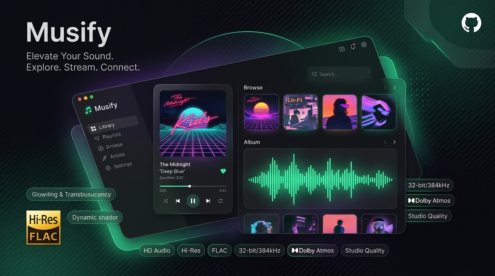

<div align="center">



# 🎵 Musify
### Studio-Grade Music & Playlist Downloader with Pro ID3 Tagging

[](LICENSE)
[](https://www.python.org/)
[](https://fastapi.tiangolo.com/)
[](README.md)
[](README.md)

<br />



<p align="center">
  <b>Musify</b> is an ultra-fast, zero-cost desktop & web application designed to clone and download Spotify playlists, albums, and tracks in studio-grade audio quality (up to 320 kbps MP3 & lossless FLAC) with authentic metadata, high-resolution cover art, and sequence-accurate <code>.m3u8</code> playlist cloning.
</p>

[✨ Features](#-key-features) • [🚀 Quick Start](#-quick-start) • [🎧 In-App HQ Audio](#-in-app-hq-player) • [📂 Project Architecture](#-project-architecture) • [⌨️ Shortcuts](#-keyboard-shortcuts)

</div>

---

## ✨ Key Features

- **⚡ 100% Free & Zero API Keys Required**:
  - Leverages Spotify's public embed architecture to resolve track information without paid Spotify Developer accounts or rate-limited credentials.
  - Matches audio against high-bitrate YouTube Music and multi-source streams with automated fallback logic.
- **🏷️ Authentic Studio Metadata Tagging**:
  - Automatically embeds complete ID3 tags via Mutagen: Title, Artists, Album, Release Date, Track Numbering, and Disc Position.
  - Injects full-resolution album cover art directly into audio files (`APIC` / `covr`).
- **📑 Sequence-Preserving Playlist Cloning (`.m3u8`)**:
  - Generates `.m3u8` playlist files alongside your audio files so you can import playlists into VLC, Foobar2000, Apple Music, or mobile media players with exact sequence ordering.
- **🎧 Built-in Studio HQ Audio Player**:
  - Listen to 30-second Spotify previews before downloading.
  - Once downloaded, click the **Glowing Green (HQ)** badge to stream the full studio-quality track directly from your local disk with waveform seek controls.
- **🚀 Ultra-Fast Multi-Threaded Engine**:
  - Download up to 6 tracks simultaneously with staggered thread pooling and bot-proof rate-limit protections.
  - Live speedometer (`⚡ MB/s`), dynamic ETA calculator, and slide-up active queue drawer.
- **🔄 Smart 1-Click Retry Mechanism**:
  - Automatically isolates failed downloads and displays a **⚡ Retry Failed Tracks** button to re-queue them in one click.
- **🔍 60 FPS Progressive Rendering & Quick Chips**:
  - Smooth virtual batching handles massive 2,500+ track playlists without dropping frames.
  - Filter by **All**, **Selected**, **Unselected**, **Downloaded**, or **Failed** with live count badges.
  - Full **Shift-Click range selection** and filter-scoped selection.
- **📋 Automatic Clipboard Detection**:
  - Auto-detects copied Spotify links upon focusing the window for 1-click loading.

---

## 🎛️ Audio Quality Presets

| Format | Bitrate / Quality | Best For |
|---|---|---|
| **MP3** | `320 kbps` (Maximum) | Universal compatibility, car stereos, DJ equipment |
| **M4A / AAC** | `256 kbps` (High) | Apple devices, iOS, macOS, native QuickTime |
| **FLAC** | `Lossless Source` | Audiophile archiving, studio reference systems |
| **OPUS** | `256 kbps` (Modern) | Best quality-to-size ratio, Discord & modern players |

---

## 🚀 Quick Start

### Windows Desktop (One-Click)
Simply run either launcher from the project folder:
- **`Musify.bat`** (or `run.bat`) — Initializes the Python environment, installs dependencies, verifies the FFmpeg engine, and launches the native desktop window.
- **`Musify.vbs`** — Launches the application silently without opening a terminal background window.

```powershell
# Or launch directly from terminal
python desktop.py
```

---

### Manual Setup (All Platforms)

1. **Clone the repository**:
   ```bash
   git clone https://github.com/YOUR_USERNAME/Musify.git
   cd Musify
   ```

2. **Create and activate a virtual environment**:
   ```bash
   # Windows
   python -m venv .venv
   .\.venv\Scripts\activate

   # macOS / Linux
   python3 -m venv .venv
   source .venv/bin/activate
   ```

3. **Install dependencies**:
   ```bash
   pip install -r requirements.txt
   ```

4. **Verify FFmpeg audio engine**:
   ```bash
   python setup_ffmpeg.py
   ```

5. **Start Musify**:
   ```bash
   # Desktop Window (Windows / macOS)
   python desktop.py

   # Web Server Only (Headless / Docker)
   python backend/main.py
   ```
   *Visit `http://localhost:8800` in any browser.*

---

### 🐳 Docker Deployment

Run Musify anywhere with Docker:

```bash
docker build -t musify .
docker run -d -p 8800:8800 -v musify_music:/root/Music/Musify\ Downloads musify
```

Access Musify at `http://localhost:8800`.

---

## ⌨️ Keyboard Shortcuts

| Shortcut | Action |
|---|---|
| `/` | Focus playlist URL bar or in-playlist filter input |
| `Ctrl + A` | Select all visible tracks |
| `Space` | Play / Pause audio preview or local HQ player |
| `Esc` | Dismiss modals, live queue drawer, or settings panel |
| `Shift + Click` | Multi-track range selection between checkboxes |

---

## 📂 Project Architecture

```text
Musify/
├── assets/                 # GitHub branding, hero banner & application logos
│   ├── hero_banner.jpg
│   └── logo.jpg
├── backend/                # High-performance Python backend
│   ├── downloader.py       # Multi-threaded download pipeline & Mutagen ID3 tagger
│   ├── spotify_meta.py     # Spotify public GraphQL & embed metadata resolver
│   └── main.py             # FastAPI server with SSE real-time event streaming
├── frontend/               # Modern Dark Spotify-inspired UI
│   ├── index.html          # Semantic HTML5 with ARIA accessibility
│   ├── style.css           # Custom dark styling, responsive grid & animations
│   ├── app.js              # State controller, progressive virtual list & audio player
│   └── logo.jpg            # App favicon
├── desktop.py              # Native desktop window controller (pywebview + uvicorn)
├── setup_ffmpeg.py         # Automated static FFmpeg audio engine resolver
├── test_suite.py           # Integration & metadata validation suite
├── Musify.bat              # One-click desktop Windows batch launcher
├── Musify.vbs              # Silent background desktop launcher
├── run.bat                 # Automated installation and launch script
├── requirements.txt        # Python dependency manifest
├── Dockerfile              # Containerized deployment specification
├── .gitignore              # Strict leak-proof Git exclude rules
└── LICENSE                 # Open-source MIT License
```

---

## 🛡️ Privacy & Security First

Musify is built with privacy and security at its core:
- **No telemetry, trackers, or cookies.**
- **No external account creation or login credentials.**
- **Strict path traversal safeguards** on local audio streaming endpoints.
- **Zero personal identifiable information (PII)** or keys stored in source code.

---

## 📄 License

Distributed under the [MIT License](LICENSE). Free for personal and educational use.

<div align="center">
  <sub>Built with ❤️ for music enthusiasts worldwide. Not affiliated with Spotify AB.</sub>
</div>
